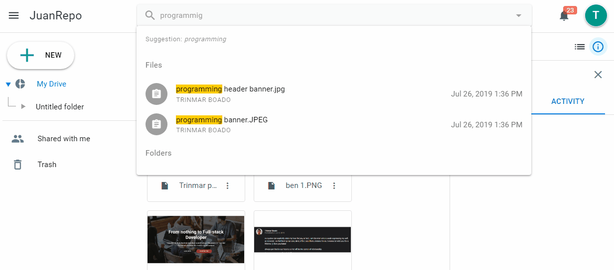

[](https://badge.fury.io/js/feathers-nedb-puzzy-search)

# feathers-nedb-puzzy-search
Add google-like `$search` to NeDB `service.find` queries.

<p align="center">
  
</p>

> **Join and support our Community** <br />
> Web and Mobile Developers PH <br />
> [ [Facebook Page](https://fb.com/webmobile.ph) | [Group](https://fb.com/groups/webmobile.ph/) ]

## Install
```
npm install feathers-nedb-puzzy-search
```

## Usage
```js
const search = require('feathers-nedb-puzzy-search')
const messages = app.service('messages')

// enable for message service, may use app.hooks too
messages.hooks({
  before: {
    find: search({['name', 'email']})
  }
})

let res = await service.find({ query: { name: { $search: 'ello' } } })
let res = await service.find({ query: $search: 'ello' } })
```
Besure to whitelist non-standard query parameters in your model.
That's `['$text', '$regex']` for MongoDB , and `['$where', '$regex']` for NeDB. 

### Options
`feathers-nedb-puzzy-search` take two options in NeDB `$where` mode:

```js
search({
  fields: ['search.this.path', 'this.path.too', 'title'],
  deep: true
})
```

- `fields` - Specify which fields to search.
- `deep`- If true and `fields` is undefined, will search deep in objects.

In NeDB `$regex` mode it takes as service options the following:

- `excludeFields` - Specify which fields to exclude from search.
- `fields` - Specify which fields to search. Mutually exclusive. 

As query parameters it also takes `$caseSensitive`

### Complete example
```js
const feathers = require('feathers')
const hooks = require('feathers-hooks')
const NeDB = require('nedb')
const service = require('feathers-nedb')
const search = require('feathers-nedb-puzzy-search')

const Model = new NeDB({
  filename: './example.db',
  autoload: true
})

const app = feathers()
app.configure(hooks())
app.use('/test', service({ Model }))
app.hooks({
  before: {
    find: search({
      // if omitted, then it will search all properties of documents
      fields: ['title', 'description']
    })
  }
})

// you need node v7 or above for async / await syntax
async function testDatabase () {
  let service = app.service('test')
  await service.create([
    { 'title': 'asdf' },
    { 'title': 'qwerty' },
    { 'title': 'zxcvb' },
    { 'title': 'hello world' },
    { 'title': 'world around' },
    { 'title': 'cats are awesome' },
  ])

  let res = await service.find({ query: { $search: 'world' } })
  let res = await service.find({ query: { title: { $search: 'ello' } } })

  console.log(res)
  // [ { title: 'world around', _id: '1RDM5BJWX4DWr1Jg' },
  //   { title: 'hello world', _id: 'dX4bpdM1IsAFkAZd' } ]
  //   { title: 'hello world', _id: 'dX4bpdM1IsAFkAZd' } ]
}

testDatabase()
  .catch(e => console.error(e))
```

# *Join and support our Community* <br /> **Web and Mobile Developers PH** <br/> [ [Facebook Page](https://fb.com/webmobile.ph) | [Group](https://fb.com/groups/webmobile.ph/) ]

## License
ISC © 2019 Trinmar Boado
MIT © 2019 Ray Foss
MIT © 2017 Arve Seljebu
